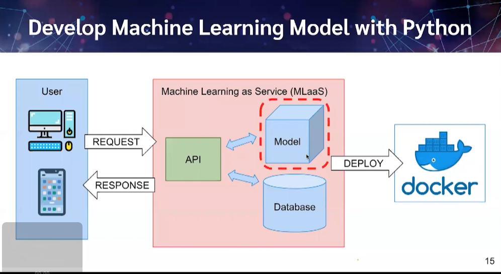

# Super AI Engineer Course - [Introduction to Deployment (Intermediate)](https://mooc.aiat.or.th/courses/introduction-to-deployment-intermediate/)

<p>This project is a part of the "Super AI Engineer Course" offered by AIAT. The course provides an introduction to deployment of machine learning models, specifically creating APIs to get model results.</p>
<h2> Description</h2>
<p>In this project, we will be deploying a machine learning model as an API. The model will take input in the form of an image and return the predicted class of the object in the image. We will be using Flask, a Python web framework, to create the API.</p>
<h2>Prerequisites</h2>
<p>To follow along with this project, you should have a basic understanding of:

<li>Python programming language</li>
<li>Flask web framework</li>
<li>Machine learning concepts</li>
<li>RESTful API design principles</li>
</p>
<h2> File Explanation</h2>
<p>
<ul>App.py: This file contains the code for the API. It's likely that this file uses a web framework like Flask or FastAPI to handle incoming requests, interact with the model, and return responses to the client. The file may include endpoints that accept user input in the form of features for an Iris flower, and then return a prediction for the flower's class (e.g., "setosa", "versicolor", or "virginica").</ul>
<ul>iris.model: This is a file that contains the pre-trained model for the Iris flower classification task. It's likely that this file was generated using a machine learning library like Scikit-learn or TensorFlow. The model file may contain the weights and biases of a neural network or the parameters of a different type of machine learning algorithm. The App.py file will likely use this model file to make predictions for incoming requests.</ul>
<ul>model.ipynb: This file is likely a Jupyter Notebook that was used to develop and train the Iris flower classification model. The Notebook may contain code for preprocessing the data, splitting it into training and testing sets, defining and training the model, and evaluating its performance. The Notebook may also include visualizations of the data or model output, as well as explanations of the steps taken during the development process.</ul>


</p>

<h2>Usage</h2>
<p>To start the API server, run the following command:</p>

```
python app.py
```

<p>The API server will start running on http://localhost:5000. You can test the API using any RESTful client, such as curl or Postman.</p>

## Picture of model

